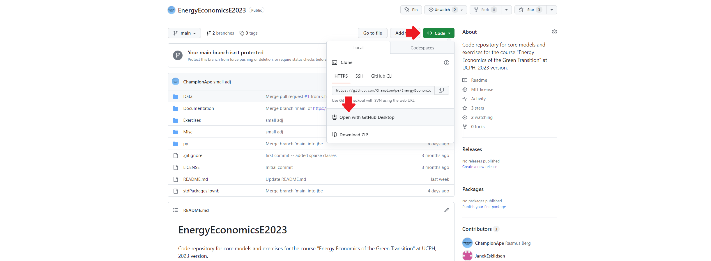
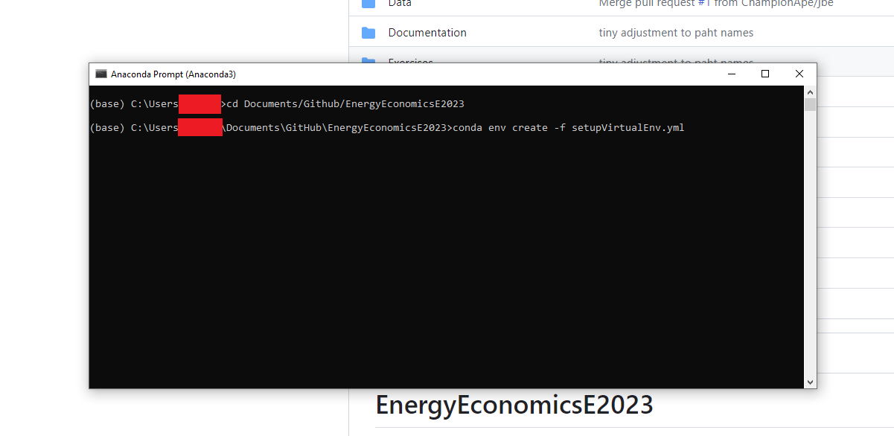
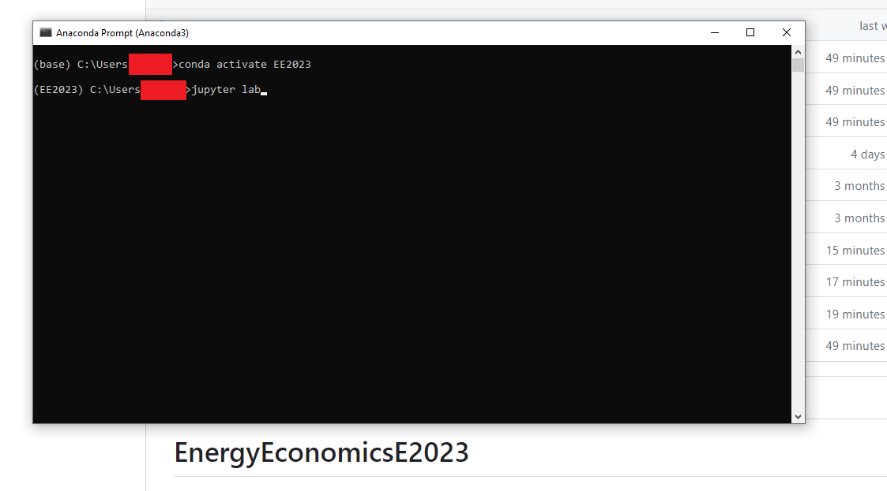

# EnergyEconomicsE2024
Code repository for core models and exercises for the course "Energy Economics of the Green Transition" at UCPH, 2024 version.

## Installation guide:
The models require installation of Python (e.g. through Anaconda), some type of git tool (e.g. Github Desktop, Git, Tortoise), and an editor for python code (e.g. VSCode or Sublime). The course *Introduction to Programming and Numerical Analysis* provides some pretty detailed guides for setting up Python and VSCode: https://numeconcopenhagen.netlify.app/guides/. We do, however, rely on different packages and a slightly different setup. The following is a simple installation guide:
* Install Anaconda distribution of Python (default settings).
* Install Github Desktop.
* Navigate to the course repository, ```Code``` tab and then ```Open with Github Desktop```. 
  
* Open "Anaconda Prompt" ("Terminal for Mac) and navigate to the folder where you've cloned the repo using the ```cd``` command.
* Install virtual environment writing: ```conda env create -f setupVirtualEnv.yml``` (You have to press ```y+enter``` to proceed afterwards).
  

### Opening/runnning exercises
The steps above install what is called a virtual environment on your computer called ```EE2024```; this is a specific copy of your Python installation that has specific versions of relevant packages installed. Now, everytime you work in this course, do the following: Open Anaconda Prompt (or Terminal for Mac) and add ```conda activate EE2024```. Then, you can open e.g. the Jupyter Lab that exercises are written in by calling  ```jupyter lab```.

*Note: You have to keep this prompt/terminal open as long as you work in your notebook.*
